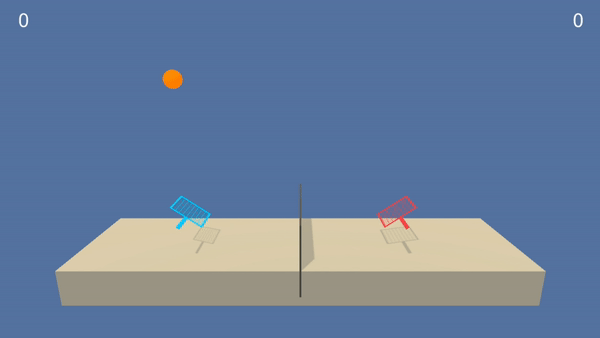

# Udacity Deep Reinforcement Learning Tennis



## Background
This project involves training 2 agents (in parallel) to play tennis against one another. In particular, the agent has to bounce a ball over a net.

### State Space
There are 24 dimensions comprised of the position and velocity of the ball and racket.

### Action Space
It is a continuous action space in a form of a vector of size 2 corresponding to movement toward (or away from) the net, and jumping.

### Reward
* +0.1 for each time the agent hits the ball over the net.
* -0.01 for each time the agent lets the ball hit the ground or hits the ball out of bounds.

### Benchmark Mean Reward
The environment is considered solved for an average reward of +0.5 over 100 consecutive episodes, after taking the maximum over both agents.


## Installation
1. Follow this link to get started:

https://github.com/udacity/deep-reinforcement-learning#dependencies

2. Navigate to `deep-reinforcement-learning` directory in your `drlnd` environment
```
cd deep-reinforcement-learning
```

3. Clone the repo
```
git clone https://github.com/rtmink/udacity-drl-tennis.git
```

4. Navigate to `udacity-drl-tennis` folder
```
cd udacity-drl-tennis
```

5. Unzip the unity environment
```
unzip Tennis.app.zip
```

## Training & Report
Run the following command in the `udacity-drl-tennis` folder:
```
jupyter notebook
```

In the notebook, refer to `Report.ipynb` to see how the agents are implemented and trained. The implementation includes the model architecture of the neural networks. A plot of rewards per episode maxed over both agents is also shown to show the number of episodes needed to solve the environment. Lastly, it highlights ideas for future work.

## Evaluation
Refer to `Tennis.ipynb` to see how the trained agents perform in Unity Tennis environment built for Udacity.
